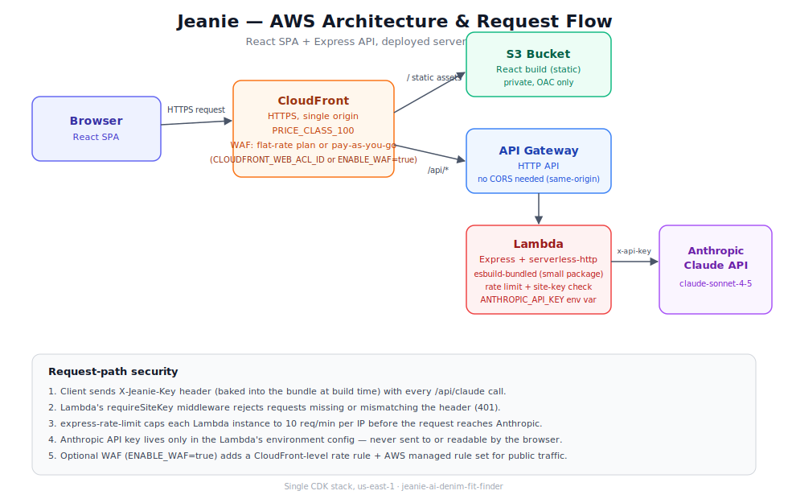

# Jeanie — AI Denim Fit Finder

Demo – digitalculture

---

## OVERVIEW

---

This project demonstrates the deployment of an **AI-powered body-shape and denim fit analyzer** on **AWS serverless infrastructure**.

The application is a **React single-page app** backed by an **Express API** that calls the **Anthropic Claude API** to analyze a user's uploaded photo, classify their body shape against five archetypes (separate taxonomies for women's and men's fit, selectable via a toggle), and recommend jean cuts and brands matched to that shape. The goal is to validate that the full request path — photo upload, AI analysis, brand recommendation, and click tracking — works end-to-end on a CDN-fronted serverless backend.



We will build:
- A React frontend (Create React App) served as a static site
- An Express API wrapped for AWS Lambda
- A CloudFront distribution routing static assets and `/api/*` traffic
- API Gateway (HTTP API) in front of the Lambda
- Anthropic API key passed to Lambda as an encrypted-at-rest environment variable
- WAF, either bundled via a CloudFront flat-rate pricing plan (can be $0/mo) or opt-in pay-as-you-go
- An optional HTTP Basic Auth gate (CloudFront Function) for password-protecting test deploys

### Request Routing Table

| Path | Target | Behavior |
|---|---|---|
| `/` , static assets | S3 (React build) | Serves the SPA |
| `/api/claude` | API Gateway → Lambda | Proxies to Anthropic API for body-shape analysis |
| `/api/r` | API Gateway → Lambda | Tracked redirect to brand shopping links |

---

## STEP-BY-STEP DEPLOYMENT

---

### 1. CONFIGURE AWS CREDENTIALS

We begin by configuring AWS CLI credentials with permissions to create CloudFront, Lambda, API Gateway, S3, and IAM resources.

```
aws configure --profile <your-profile>
```

### 2. BOOTSTRAP CDK

One-time per AWS account/region:

```
cd infra
npm install
npx cdk bootstrap aws://<ACCOUNT_ID>/us-east-1
```

### 3. INSTALL DEPENDENCIES

```
cd ..
npm install
```

Installs the frontend/backend runtime dependencies (React, Express, `serverless-http`, AWS SDK) and `esbuild`, which the CDK Lambda construct uses to bundle only the code the API actually needs.

### 4. BUILD THE REACT APP

```
npm run build
```

Produces the static `build/` directory that gets deployed to S3.

### 5. DEPLOY THE STACK

```
npm run deploy
```

This runs `react-scripts build` then `cdk deploy` from `infra/`. First deploy takes ~5–10 minutes (CloudFront distribution creation).

**Outputs:**

| Output | Description |
|---|---|
| `SiteUrl` | CloudFront URL — the live application |
| `ApiUrl` | API Gateway endpoint (proxied through CloudFront `/api/*`, not usually hit directly) |
| `BucketName` | S3 bucket holding the static build |

### Anthropic API key

The key is passed as a Lambda environment variable (encrypted at rest by Lambda by default) rather than Secrets Manager — this trades away key rotation/audit-trail features to avoid the flat $0.40/mo Secrets Manager fee, a reasonable trade only at genuinely low request volume. Set it in your shell before deploying:

```
export ANTHROPIC_API_KEY=$(grep ANTHROPIC_API_KEY ../.env | cut -d= -f2)
npm run deploy
```

`cdk deploy` will fail fast with a clear error if `ANTHROPIC_API_KEY` isn't set in the environment.

---

## TESTING

---

After deployment, open the `SiteUrl` and validate:

| Test | Expected Result |
|---|---|
| Load `SiteUrl` | React app renders (hero, analyzer, shapes, brands) |
| Upload a photo → Analyze | Body-shape result returns with confidence score and traits |
| Wait for brand match | 6 brand + product recommendations render with working shop links |
| Click a brand "Shop" link | Opens the brand's site in a new tab; click logged via `/api/r` |
| Resize to mobile width | Layout reflows; camera capture button available on upload |

---

## KEY LEARNINGS

---

**Serverless Express**
Wrapping an existing Express app with `serverless-http` lets the same `server.js` run locally (`node server.js`) and inside Lambda without code changes — the app only calls `app.listen()` when *not* running under Lambda.

**Lambda Bundle Size**
Naively zipping the whole project for a Lambda asset pulls in unrelated frontend tooling (React, its build chain) and can blow past Lambda's 250MB unzipped limit. Using CDK's `NodejsFunction` with esbuild traces the real dependency graph from the handler and bundles only what's actually imported.

**Secrets Never Touch the Client**
The Anthropic API key is read server-side inside the Lambda (as an encrypted-at-rest environment variable) — the browser never sees it. The proxy pattern (client → own backend → third-party API) keeps the key private while still letting the SPA call an LLM.

**CDN + API Behind One Origin**
Routing both the static site and `/api/*` through the same CloudFront distribution avoids CORS entirely for same-origin requests, simplifying the client fetch calls.

**Cost Control via Feature Flags**
WAF is gated behind an `ENABLE_WAF` environment variable so a cheap test deploy can skip it (~$6/mo saved) while a production deploy can flip it on with no code changes.

**Flat-Rate Pricing Plans Change the WAF Calculus**
CloudFront's newer per-distribution flat-rate plans (Free/Pro/Business/Premium) bundle WAF, DDoS protection, and bot management into one monthly price — the Free tier includes WAF at $0 up to 1M requests/100GB per month. Enrolling attaches an AWS-managed Web ACL that **cannot be removed while the plan is active**. CDK must reference that existing ACL (`CLOUDFRONT_WEB_ACL_ID`) rather than manage its own — leaving it unset makes the next deploy try to strip the required association, which AWS rejects. The plan also takes over `PriceClass` (an explicit price class isn't allowed on Free-plan distributions), so that property is conditionally omitted too.

**Right-Sizing Secret Storage for Volume**
Secrets Manager costs a flat $0.40/mo per secret regardless of usage — real money at near-zero request volume. A Lambda environment variable is encrypted at rest by default and free, at the cost of losing rotation and a dedicated access audit trail. Below a couple hundred requests/month, that trade is worth making; above it, or for a production/public deploy, Secrets Manager's rotation support earns its cost back.

**Edge Functions for Zero-Cost Access Gating**
A pre-launch deploy can be password-protected without any backend changes: a CloudFront Function on `viewer-request` gates the whole distribution — static site and API alike — before requests ever reach an origin. It's opt-in via `BASIC_AUTH_PASS` at deploy time, free at test volumes (2M invocations/month included), and removed by redeploying with the var unset. The access code lives in the function's code, so it deters casual visitors rather than determined attackers — the right tool for "share a test link," not production auth.

**A Branded Sign-In Page Beats the Native Basic Auth Prompt**
The gate initially used real HTTP Basic Auth, which triggers the browser's own unstyled login dialog — functional, but off-brand and a jarring first impression for a tester. Switching the same CloudFront Function to check a `jeanie_auth` cookie instead — serving a custom HTML page (matching the app's actual logo, fonts, and color palette) on a 401 when the cookie's missing, and setting it via a `GET /__unlock?key=...` form submission — gets a fully branded sign-in screen with zero new infrastructure: no Cognito, no Lambda@Edge, still a single stateless edge function.

**Don't Animate Opacity on a Reveal — Animate Position**
The sign-in page's 3D entrance (card "jumps out" via `translateZ`/`rotateX`/`scale` with a single-overshoot back-ease) originally faded in from `opacity:0`. Headless testing caught the exact failure this codebase's own motion rules warn about: on a backgrounded or throttled tab, the animation can freeze mid-keyframe, and a frozen `opacity:0` state ships a blank page. Fix was to drop opacity from every entrance keyframe and animate only transform — a frozen mid-flight card is still fully visible (just mid-motion), never invisible. A physical object jumping into frame doesn't fade in anyway; removing the opacity animation made the motion more accurate to the metaphor, not just safer.

**Separate Taxonomies, Not a Shared One**
Men's and women's body-shape frameworks use different archetype names and measurement vocabulary in the fashion industry — reusing the women's five shapes (Hourglass, Pear, Apple, Rectangle, Inverted Triangle) with "Bust" labels for men's analysis would misclassify typical male builds and read oddly in the UI. Jeanie defines a second five-archetype taxonomy for men (Trapezoid, Rectangle, Triangle, Inverted Triangle, Oval) with Chest/Waist/Hip labels, selected via a toggle that also switches which AI system prompt (and which shape enum, and which brand's product-line examples) is sent to Claude — the two categories share the same UI shell and Rectangle/Inverted Triangle icons where the concept genuinely overlaps, but nothing is silently reused where the underlying body-shape concept differs.

---

## TOOLS & SERVICES USED

---

AWS Lambda, API Gateway (HTTP API), CloudFront, S3, WAFv2 (optional), CloudWatch Logs, AWS CDK (TypeScript), React, Express, Anthropic Claude API, esbuild

---

## SUMMARY

---

This project successfully demonstrates how to:

- Deploy a React SPA + Express API as a serverless application on AWS
- Proxy calls to a third-party LLM API without exposing credentials client-side
- Bundle a Lambda correctly to avoid oversized deployment packages
- Front both static and dynamic traffic through a single CloudFront distribution
- Gate optional security controls (WAF) behind cost-conscious feature flags
